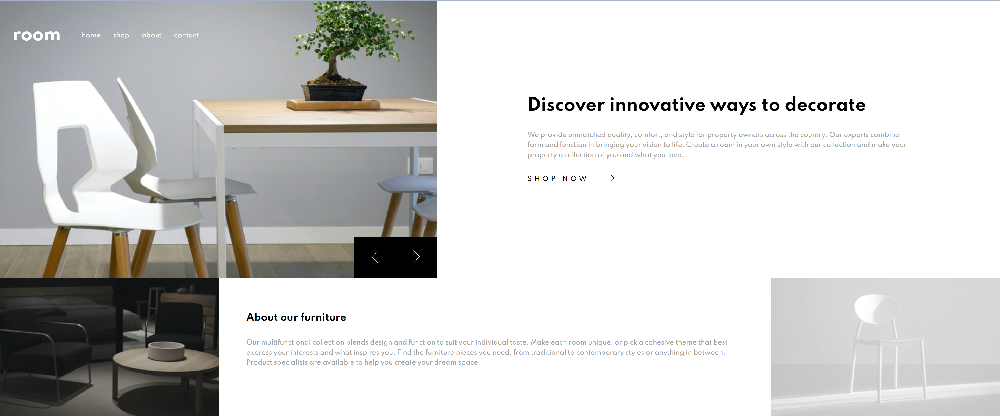

# Frontend Mentor - Room homepage solution

This is a solution to the [Room homepage challenge on Frontend Mentor](https://www.frontendmentor.io/challenges/room-homepage-BtdBY_ENq). Frontend Mentor challenges help you improve your coding skills by building realistic projects. 

## Table of contents

- [Frontend Mentor - Room homepage solution](#frontend-mentor---room-homepage-solution)
  - [Table of contents](#table-of-contents)
  - [Overview](#overview)
    - [The challenge](#the-challenge)
    - [Screenshot](#screenshot)
    - [Links](#links)
  - [My process](#my-process)
    - [Built with](#built-with)
  - [Author](#author)

## Overview

### The challenge

Users should be able to:

- View the optimal layout for the site depending on their device's screen size
- See hover states for all interactive elements on the page
- Navigate the slider using either their mouse/trackpad or keyboard

### Screenshot

### Links

- Live Site URL: [https://mariamoraan.github.io/room-homepage/](https://mia-moran.github.io/room-homepage/)

## My process

### Built with

- Semantic HTML5 markup
- CSS
- Flexbox
- CSS Grid
- [React](https://reactjs.org/) - JS library

## Author

- Website - [María Morán](https://www.mariamoran.com)
- Frontend Mentor - [@mia-moran](https://www.frontendmentor.io/profile/mia-moran)
- Twitter - [@_mariamoraan](https://www.twitter.com/_mariamoraan)

**Note: Delete this note and add/remove/edit lines above based on what links you'd like to share.**

